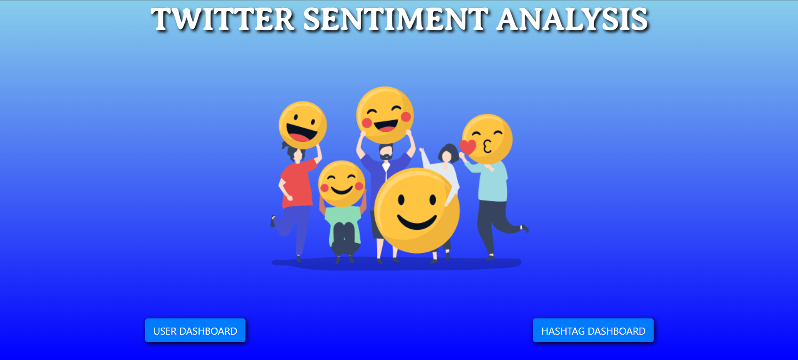
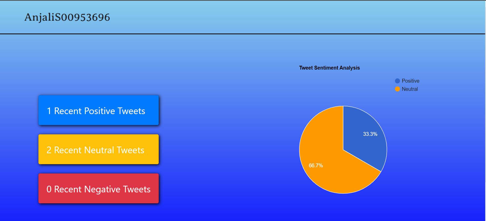
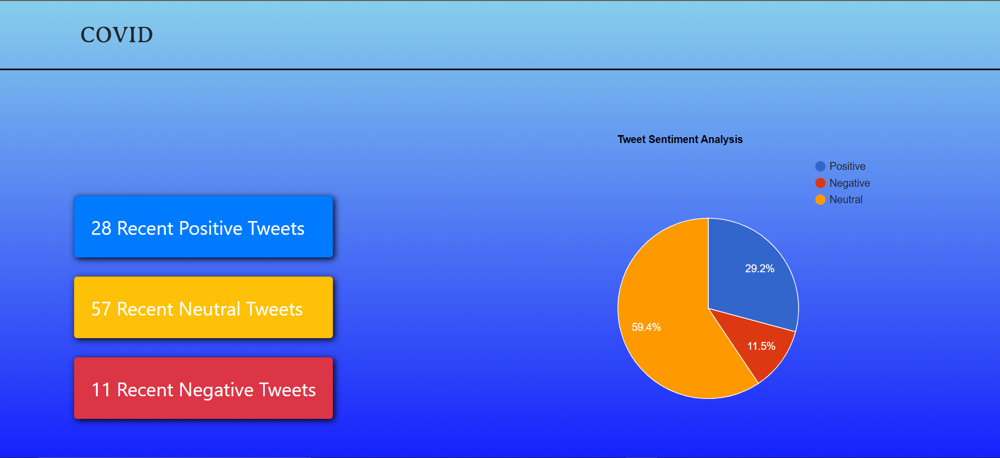

# Twitter Sentiment Analysis

## Introduction
Social Media usage is growing at an exceptional pace, be it brand or product reviews by customers or putting up a political opinion everything goes on social media. So, it is becoming important to analyse the sentiments of content that is posted on social media platforms to decrease the amount of negative/ abusive content on platforms.
 

The project is based on predicting the sentiments of tweets using TextBlob library of python which classify tweets as **Positive** ,**Negative** or **Neutral** tweets based on the words used in it's content.
Collection and analysis of tweets sentiments data is done in two ways :
- **User Dashboard:** It shows a graphical analysis of the percentage of positive, negative and neutral recent tweets of certain user. Also, it shows the exact number of recent tweets of user in each category.

- **Topic Dashboard:** It shows a graphical analysis of the percentage of positive, negative and neutral recent tweets on that topic. Also, it shows the exact number of recent tweets on that topic in each category.

  
## Approach
User provides user-id/ topic according to their choice and then tweets on that particular topic or by specific user whose user-id has been provided are fetched using Twitter API. 
But before using Twitter API in the project it is authenticated by using personal keys and secrets of Twitter developer account while initializing the class object.
Tweets returned by the API are then parsed to get the content of tweets then tweet text is cleaned by by removing links, special characters using simple regex statements and it's TextBlob object is created which predicts the sentiment of tweet.
 
TextBlob uses textblob's sentiment method to predict the sentiment in which if polarity of sentiment is greater than 1 then it is positive, if 0 then neutral else negative.

  
## Tech Stack
- Python
- HTML
- CSS
- Javascript

**Libraries/Frameworks Used:**
- Flask
- Tweepy
- TextBlob
- Bootstrap
- Google charts

  
## Applications
- Sentiment Analysis can be used to restrict negative/abusive content on social media platforms
- Sentiment Analysis can be used to know customer's opinion on product/brand
